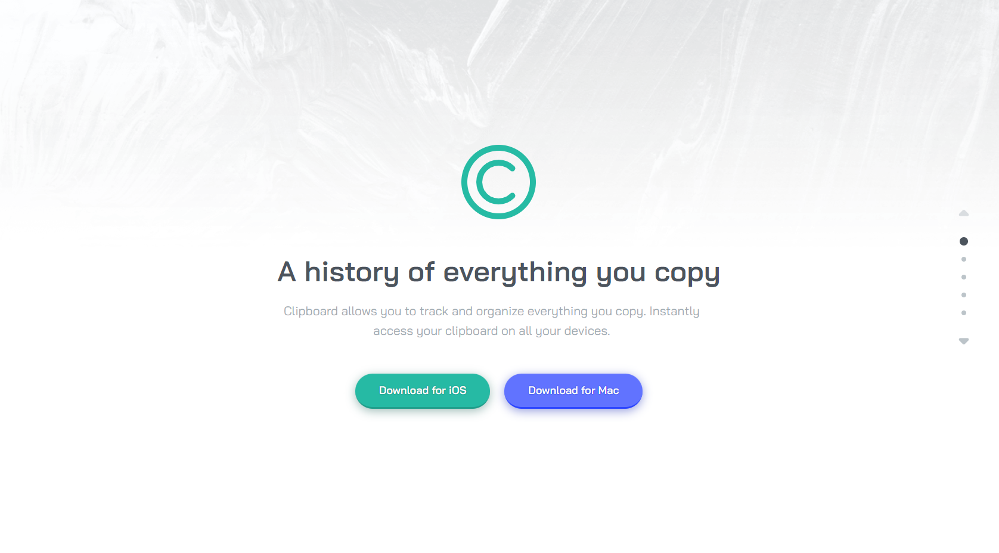
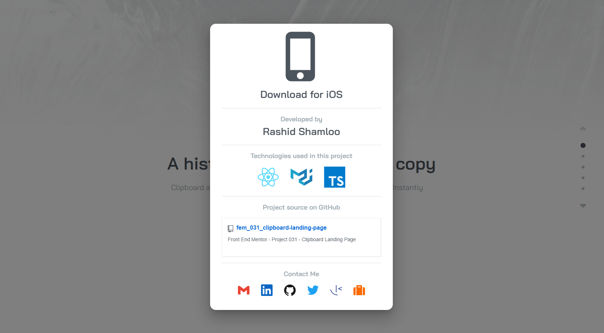
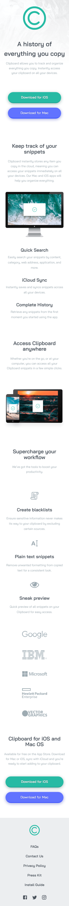
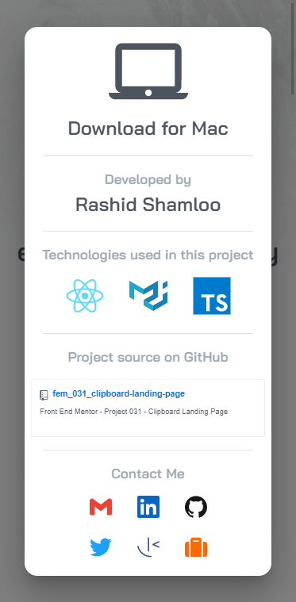

# Front End Mentor - Project 031 - Clipboard Landing Page

This is a solution to the [Clipboard Landing Page challenge on Frontend Mentor](https://www.frontendmentor.io/challenges/clipboard-landing-page-5cc9bccd6c4c91111378ecb9).

## Table of contents

- [Overview](#overview)
  - [Screenshot + Video](#screenshot--video)
  - [Links](#links)
- [My process](#my-process)
  - [Built with](#built-with)
  - [What I learned](#what-i-learned)
- [Author](#author)

## Overview

### Screenshot + Video

- Desktop

https://user-images.githubusercontent.com/121501991/231036940-26bee6df-f027-4155-8eb8-0e20c08cb18c.mp4

- Mobile

 

### Links

- Solution URL: https://github.com/rashidshamloo/fem_031_clipboard-landing-page/
- Live Site URL: https://rashidshamloo.github.io/fem_031_clipboard-landing-page/

## My process

### Built with

- Vite / React.js
- TypeScript
- Material-UI
- Semantic HTML5 markup

### What I learned

- Using double arrow functions in React to pass another prop alongside the event to the handleEvent function.
- How `Theming` in Material-UI works and customizing it in TypeScript
- Using the customized theme variables inside components
- Styling Material-UI components using the `sx` styles
- Customizing Material UI components in multiple ways in TypeScript:
    - `styled()` utility
    - wrapper component
    - targeting classes directly
    - using `inherit` and setting the style on the parent element
- Using `Grid`, `Box`, `Typography`, `Link`, `Tooltip` etc. components in Material-UI
- Using `CssBaseline` in Material-UI to remove the default paddings/margins
- Using the `Dialog` component to show a modal in Material UI and setting the contained element's properties using the `PaperProps` property
- Using `TransitionComponent` and `TransitionProps` to add animations in Material UI
- Extending interfaces in TypeScript
- Using `Omit<INTERFACE_NAME,'KEY'>` to replace/override a key when extending interfaces in TypeScript
- How to use `React.forwardRef<element,props>((props,ref)=>{})` to add ref to a customized `Link` component that is the child of a customized `Tooltip` component. (took hours... I was trying to add ref to the parent element by mistake...)
- `Generics`, `Unions`, and `Casting` in TypeScript
- Using `getBoundingClientRect()` to get an element's position
- Using `scrollTo()` and `ScrollIntoView()` to scroll to positions/elements
- Using `scroll-behavior:smooth` in CSS to enable smooth scrolling
- Using `scroll-snap-type`, `scroll-snap-position` and `scroll-snap-stop` to add scroll snapping to various elements
- Detecting when an element is in view using intersection observer and `react-intersection-observer`
- Implementing a full page side dot-navigation from scratch using `react-intersection-observer`
- using `React.forwardRef()` to pass refs to functional components in React
- Using `Exclude` to exclude a type in union types in TypeScript
- Using `Object.assign()` to merge objects
- Exporting variables after modifying them with `export {VAR}`

## Author

- Portfolio - [rashidshamloo.ir](https://www.rashidshamloo.ir)
- Frontend Mentor - [@rashidshamloo](https://www.frontendmentor.io/profile/rashidshamloo)
- Twitter - [@rashidshamloo](https://www.twitter.com/rashidshamloo)
